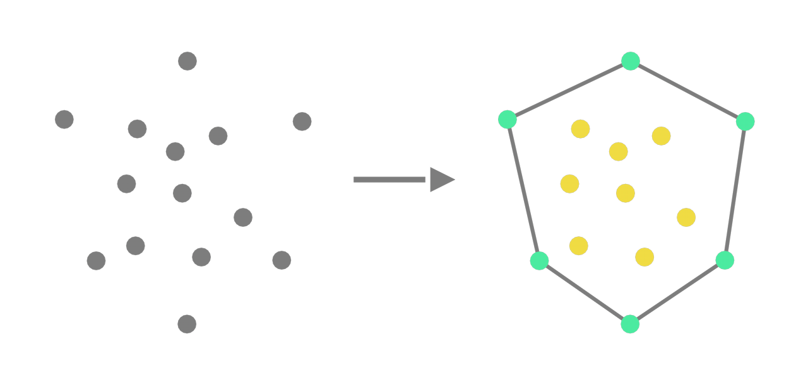

# Convex Hull 2D
 

# A Cinema 4D plugin to compute 2-dimensional convex hulls.
### Currently built for R25.120

#### Installing the plugin:
	Create a "plugins" folder inside your Cinema 4D R25 directory (by default it is at "C:\Program Files\Maxon Cinema 4D R25").
	Inside the plugins folder create a folder named "Convex Hulls 2D" and paste the "res" folder and "convexhull2d.xdl64" file inside it.
	You will find the plugin under Extensions tab after reloading Cinema 4D.

#### What is a Convex Hull:
	Let's first take a look at the definition of a convex hull before exploring the possible use cases of the plugin.
	
	Given a set of coplanar points S, a 2-dimensional convex hull C is a smallest convex polygon that
	encloses S.
	
