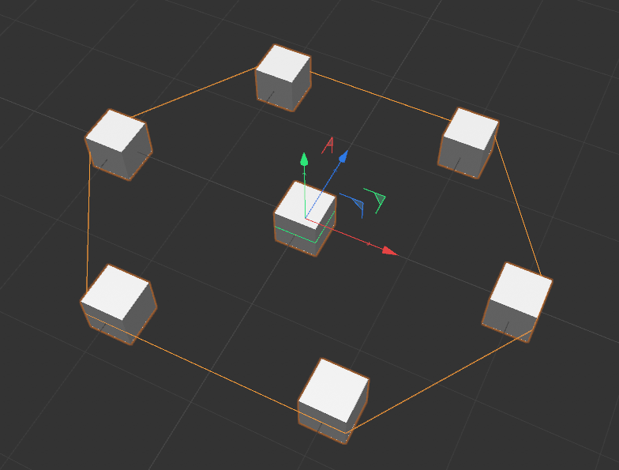

# Convex Hull 2D
 

# A Cinema 4D plugin to compute 2-dimensional convex hulls.
### Currently built for R25.120

#### Installing the plugin:
	Create a "plugins" folder inside your Cinema 4D R25 directory (by default it is at "C:\Program Files\Maxon Cinema 4D R25").
	Inside the plugins folder create a folder named "Convex Hulls 2D" and paste the "res" folder and "convexhull2d.xdl64" file inside it.
	You will find the plugin under Extensions tab after reloading Cinema 4D.

#### What is a Convex Hull:
	Let's first take a look at the definition of a convex hull before exploring the possible use cases of the plugin.
	
	Given a set of coplanar points S, a 2-dimensional convex hull C is a smallest convex polygon that
	encloses S.
	

## How to use the plugin:
	
The Convex Hull 2D object can be found under the "Extensions" tab. 

The Convex Hull is computed on it's children object's data. The data is interpreted differently depending on the selected mode in the object properties.
There are currently two convex hull modes: **Pivot point based** and **Geometry based**.

#### Pivot point based
	By default the Convex Hull 2D object snaps it's childern objects to it's local XZ plane and
	computes convex hull on it's child objects' pivot points. The child objects are free to be moved around
	in Convex Hull 2D object's XZ plane.

  
   

#### Geometry based
	To use Geometry based mode we need to enable it first in the Object settings by checking on "Geometry based" option.
	This mode computes the convex hull on the points produced by intersecting the world X-Z plane with the childern objects.
	Note that the children objects must be in editable mode to be considered for computation.
	

  
   

#### Define custom plane of intersection
	We can also overwrite the default "world X-Z" plane and define a custom plane of intersection for our convex hull calculations.
	We do so by linking a plane object to the "Plane of intersection target" linker in the Object properties. Simply create a new object,
	drag and drop it into the link area. Once the object has been linked it should have a green bounding box surrounding it. The orientation
	and the position of the linked object now defines the orientation and center of the new plane of intersection for geometry based mode.

  

  
  
  

